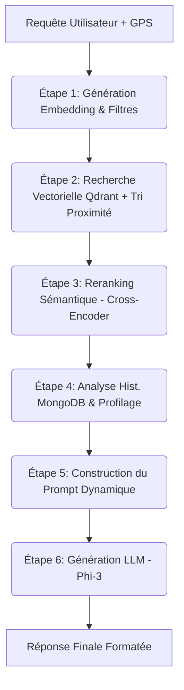

# Architecture et Fonctionnement du Système de Recommandation RAG (AntiSamsar)

Ce document explique en détail le fonctionnement du moteur de recommandation hybride (RAG + Filtrage + Profilage + Géolocalisation) développé pour AntiSamsar. Il est conçu pour vous aider à comprendre comment les différentes briques interagissent pour produire des recommandations personnalisées.

---

## 1. Vue d'Ensemble du Système

Le système repose sur une architecture **RAG (Retrieval-Augmented Generation)** enrichie par l'analyse du comportement de l'utilisateur et sa position géographique. 

**Objectif :** Transformer une recherche en langage naturel (ex: *"Je cherche un appartement à Sousse avec parking"*) en une liste d'annonces pertinentes, accompagnée d'un message généré par une IA qui justifie les choix en fonction du profil de l'utilisateur et de sa proximité.

### Composants Clés
1. **NestJS (Backend)** : L'orchestrateur principal.
2. **MongoDB** : Stockage des annonces (incluant coordonnées GPS) et de l'historique des interactions utilisateurs.
3. **Qdrant Cloud/Local** : Base de données vectorielle pour les recherches de similarité sémantique (Text & Image).
4. **Xenova (`all-mpnet-base-v2`)** : Modèle d'embedding local pour le texte.
5. **CLIP (`laion/CLIP-vit-base-...`)** : Moteur multimodal pour l'analyse d'images et le taggage automatique.
6. **AirLLM (Serveur Python)** : Héberge le LLM **Phi-3-mini**, le **Reranker** (Cross-Encoder) et le service **CLIP**.

---

## 2. Le Pipeline RAG : Étape par Étape

Lorsque le frontend appelle l'API principale `POST /recommendations/rag`, le `RecommendationService` exécute un pipeline enrichi :

### Étape 1 & 2 : Embedding, Retrieval et Géolocalisation
La requête est convertie en vecteur. Le système extrait les filtres et interroge Qdrant. 
*Nouveau :* Si l'utilisateur a activé son GPS, les résultats sont ré-ordonnés pour favoriser les biens les plus proches de sa position actuelle.

### Étape 3 : Reranking (Ré-ordonnancement)
Les 20 meilleurs résultats de Qdrant sont ré-analysés par un **Cross-Encoder** (`sentence-transformers`). Ce modèle compare la requête de l'utilisateur avec la description complète de chaque annonce pour calculer un score de pertinence plus fin, garantissant que les résultats en haut de liste correspondent parfaitement à l'intention.

### Étape 4 : Construction du Contexte Utilisateur (`UserContext`)
Le système interroge MongoDB pour analyser toutes les actions passées de cet utilisateur spécifique (`userId`). Voir la section 4 pour les détails de cette analyse.

### Étape 5 & 6 : Génération IA Optimisée via Phi-3
Le prompt est envoyé au serveur Python qui fait tourner **Phi-3-mini-4k-instruct**. Ce modèle est configuré pour :
- **Précision** : Ne pas halluciner grâce au bridage contextuel.
- **Rapidité** : Utilisation de l'attention optimisée (Eager Attention).
- **Faible ressource** : Cache déporté sur le disque D: (`HF_HOME`).

---

## 3. Extension Multimodale : Analyse d'Images (Service CLIP)

Le système a été étendu pour traiter les images de manière native via le **CLIPService** (Modèle ViT-B/32).

### Fonctionnalités Clés :
1. **Tagging Automatique** : Lors du téléchargement d'une image, le système détecte des attributs sans intervention humaine (ex: *moderne, luxueux, piscine, jardin, terrasse*).
2. **Filtrage de Qualité** : Détection des images de basse qualité ou floues pour maintenir un standard élevé sur la plateforme.
3. **Recherche Visuelle (Future)** : Possibilité de rechercher des annonces visuellement similaires aux préférences de l'utilisateur.

---

## 4. Le Moteur d'Interactions et Profilage (`UserContext`)

Pour personnaliser les recommandations, le système analyse continuellement ce que fait l'utilisateur sur l'application. Cette tâche est gérée par le `InteractionAnalysisService`.

Lorsqu'on lui demande de construire le profil d'un utilisateur, le service lance **6 agrégations MongoDB simultanées** (pour la performance) sur la collection `interactions` :

1. **`preferredCities`** : Les 5 villes les plus fréquentes dans les annonces consultées.
2. **`preferredTypes`** : Les 5 types de biens les plus fréquents (VILLA, APPARTEMENT).
3. **`averageBudget`** : La moyenne des prix des annonces où l'utilisateur a montré un vrai intérêt (VIEW, CLICK, LIKE, FAVORITE).
4. **`favoriteFeatures`** : Les équipements les plus présents dans les annonces consultées (Piscine, Parking, etc.).
5. **`recentSearches`** : Les 10 dernières recherches textuelles (lit `metadata.searchQuery` en priorité).
6. **`interactionScore`** : Calcule l'engagement total par annonce.

> [!TIP]
> **Le système de Poids d'Interactions**  
> Chaque action vaut des points. Le total par annonce est envoyé à l'IA pour qu'elle puisse dire *"Cette annonce pourrait vous plaire, vous l'avez déjà mise en favoris"*.
> - `VIEW` : 1 pt
> - `CLICK` / `SHARE` : 2 pts
> - `LIKE` : 3 pts
> - `FAVORITE` : 5 pts
> - `CONTACT_OWNER` : 10 pts

---

## 5. Le Prompt Builder et la Prévention des Hallucinations

Les modèles d'IA (LLMs) ont tendance à "halluciner" (inventer des informations) lorsqu'on leur demande de personnaliser une réponse sans leur donner assez de contexte.

Pour régler ce problème, le `PromptBuilderService` utilise la méthode `hasUserProfile()` pour vérifier si le contexte retourné par MongoDB contient des données exploitables.

### Scénario A : L'utilisateur a un historique
Si l'utilisateur a des préférences connues, le Prompt demande à l'IA d'être ultra-personnalisée :
> *"En te basant UNIQUEMENT sur les annonces ci-dessus et le profil utilisateur, rédige une recommandation... explique pourquoi elle correspond à la recherche ET au profil (villes, types, budget, équipements). Priorise les annonces avec un score d'engagement élevé (★)."*

### Scénario B : Nouvel Utilisateur (Pas d'historique)
Si le contexte est vide, on change drastiquement l'instruction pour "brider" l'IA :
> *"Cet utilisateur n'a pas encore d'historique. Base-toi UNIQUEMENT sur les annonces ci-dessus... N'invente AUCUNE préférence (ville, budget, type) qui ne serait pas explicitement mentionnée dans la requête."*

---

## 6. Gestion des Données : Embeddings et Synchronisation

Pour que la recherche vectorielle (Qdrant) fonctionne, les annonces doivent être transformées en vecteurs. 

1. **Génération (MongoDB)** : L'API `/recommendations/generate-embeddings` concatène les champs clés d'une annonce (Titre, description, prix, ville, équipements) en un seul bloc de texte, puis utilise `Xenova` pour créer un vecteur de 768 dimensions. Ce vecteur est sauvegardé dans MongoDB.
2. **Synchronisation (Qdrant)** : L'API `/recommendations/sync-qdrant` envoie par lots (batch) ces vecteurs vers Qdrant Cloud. En plus du vecteur, elle y associe un **Payload** (Titre, prix, type, ville) qui permet à Qdrant de faire le filtrage rapide de l'Étape 2 du pipeline.

---

## 7. Liste Complète des APIs (`RecommendationController`)

| Méthode | Endpoint | Rôle |
|---|---|---|
| `POST` | `/recommendations/rag` | **C'est le cœur du système.** À appeler depuis le frontend lors d'une recherche textuelle intelligente. |
| `GET` | `/recommendations/user-context/:userId` | **Outil de Debug.** Permet de voir exactement comment le système perçoit un utilisateur (ses villes préférées, son budget, etc.). |
| `POST` | `/recommendations/generate-embeddings` | **Tâche de fond (Admin).** Scanne MongoDB et calcule les vecteurs pour les nouvelles annonces ajoutées via le backoffice ou Compass. |
| `POST` | `/recommendations/sync-qdrant` | **Tâche de fond (Admin).** Pousse les vecteurs fraîchement calculés de MongoDB vers Qdrant Cloud. **Indispendable pour que les nouvelles annonces soient trouvables.** |
| `GET` | `/recommendations/embedding-status` | **Dashboard (Admin).** Indique combien d'annonces ont leurs vecteurs générés vs combien sont en attente. |
