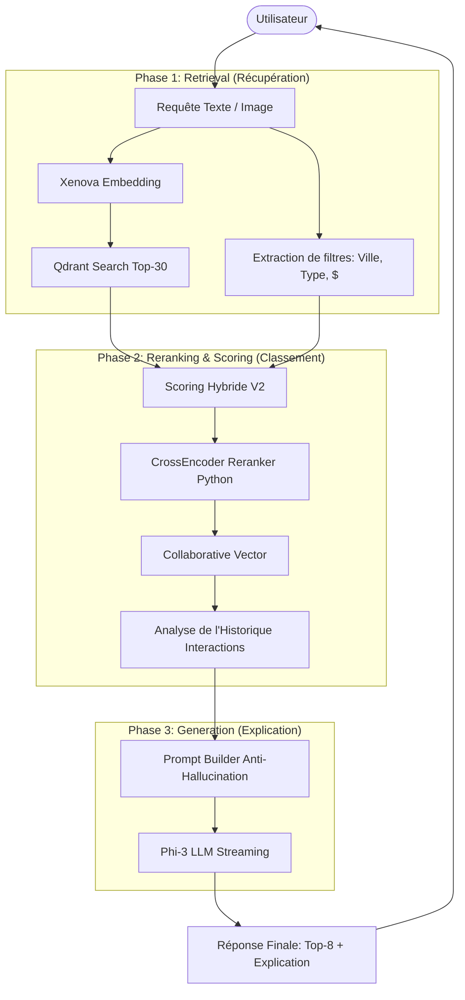

# AntiSamsar — Documentation Technique Complète

> Plateforme immobilière intelligente avec système de recommandation RAG (Retrieval-Augmented Generation)

---

## Table des Matières

1. [Vue d'ensemble du Projet](#1-vue-densemble)
2. [Architecture Globale](#2-architecture-globale)
3. [Technologies Utilisées](#3-technologies-utilisées)
4. [Backend — NestJS (`PFE-AntiSamsar-Backend`)](#4-backend--nestjs)
5. [Frontend — Flutter (`PFE-AntiSamsar-Frontend`)](#5-frontend--flutter)
6. [Service RAG — Python FastAPI (`antisamsar-rag-service`)](#6-service-rag--python-fastapi)
7. [Système de Recommandation RAG — Flux Complet](#7-système-de-recommandation-rag)
8. [APIs et Endpoints](#8-apis-et-endpoints)
9. [Bases de Données](#9-bases-de-données)
10. [Authentification & Sécurité](#10-authentification--sécurité)
11. [Communication en Temps Réel](#11-communication-en-temps-réel)
12. [Flux de Données](#12-flux-de-données)
13. [Lancement du Projet (Développement)](#13-lancement-du-projet)

---

## 1. Vue d'ensemble

**AntiSamsar** est une application mobile de petites annonces immobilières spécialisée pour le marché tunisien. Elle permet aux utilisateurs de :

- Publier, rechercher et filtrer des annonces immobilières (villas, appartements, terrains, commerces, etc.)
- Contacter les particulier/agences via messagerie interne ou téléphone
- Recevoir des **recommandations personnalisées via l'IA (RAG)** basées sur leurs interactions
- Évaluer les annonces et les particulier (système de reviews)
- Signaler des annonces frauduleuses (système de rapports)
- Recevoir des notifications en temps réel
- Administrer la plateforme via un tableau de bord dédié

---

## 2. Architecture Globale

```
┌─────────────────────────────────────────────────────────────┐
│                    APPAREIL MOBILE (Android/iOS)            │
│                   Flutter App (Dart)                        │
│              Port: accès via adb reverse                    │
└──────────────────────────┬──────────────────────────────────┘
                           │ HTTP/REST + WebSocket
                    ┌──────▼───────┐
                    │   NestJS     │
                    │   Backend    │  ← Port 3000
                    │  (Node.js /  │
                    │  TypeScript) │
                    └──────┬───────┘
           ┌───────────────┼──────────────────┐
           │               │                  │
    ┌──────▼──────┐  ┌──────▼──────┐  ┌──────▼──────┐
    │  MongoDB    │  │   Qdrant    │  │  FastAPI    │
    │  (données)  │  │  (vecteurs) │  │  RAG Svc    │
    │             │  │   Cloud     │  │  Port 8000  │
    └─────────────┘  └─────────────┘  └─────────────┘
```

### Les 3 Services Principaux

| Service | Technologie | Port | Rôle |
|---|---|---|---|
| `PFE-AntiSamsar-Backend` | NestJS / TypeScript | `3000` | API principale, auth, orchestration RAG, cache et gestion des données |
| `antisamsar-rag-service` | Python / FastAPI | `8000` | Reranking (CrossEncoder), CLIP (Multimodal) & Génération IA (Phi-3 Streaming) |
| Mobile App | Flutter / Dart | — | Interface utilisateur interactive |

---

## 3. Technologies Utilisées

### Backend (NestJS)
| Technologie | Version | Usage |
|---|---|---|
| NestJS | v11 | Framework principal |
| TypeScript | v5.7 | Langage |
| Mongoose / MongoDB | v8 | Base de données principale |
| Passport + JWT | v11 | Authentification |
| Socket.io | v4.8 | WebSockets (chat, notifs) |
| `@qdrant/js-client-rest` | v1.18 | Client Qdrant (base vectorielle) |
| `@xenova/transformers` | v2.17 | Génération d'embeddings textuels (BGE-Small/BERT) |
| `axios` | v1.16 | Requêtes HTTP vers le service RAG Python |
| Redis / Cache Manager | — | Caching des recommandations |

### Frontend (Flutter)
| Technologie | Usage |
|---|---|
| Flutter / Dart | Framework mobile multi-plateforme |
| Dio | Client HTTP avec gestion streaming pour les réponses IA |
| Provider | Gestion d'état global |
| OpenStreetMap | Cartographie intégrée |

### Service RAG (Python)
| Technologie | Usage |
|---|---|
| FastAPI | Framework API haute performance |
| Phi-3 Mini | Modèle de langage (Inférence optimisée via Transformers/Torch) |
| CLIP (`laion/CLIP-vit-base-...`) | Analyse d'images (Embeddings visuels et tagage zero-shot) |
| CrossEncoder | Reranking des résultats Qdrant (`ms-marco-MiniLM-L-6-v2`) |
| Uvicorn | Serveur ASGI avec support Streaming |

### Infrastructure
| Outil | Usage |
|---|---|
| MongoDB (Atlas ou local) | Stockage des données (incluant Latitude/Longitude) |
| Qdrant Cloud | Base de données vectorielle |
| JWT (RS256/HS256) | Tokens d'authentification |
| Nodemailer + SMTP | Emails transactionnels |

### Structure des Modules RAG (Avancée)

Le module RAG a été significativement enrichi pour supporter une approche hybride, multimodale et haute performance :

- `embedding/` : Génération automatique de vecteurs via `@xenova/transformers` (local au backend).
- `qdrant/` : Client haute performance pour la base de données vectorielle Qdrant Cloud.
- `interaction/` : Analyse granulaire en temps réel du comportement utilisateur via 6 agrégations MongoDB simultanées.
- `multimodal/` : Analyse visuelle via CLIP (extraction automatique de tags style, luxe, piscine, etc.).
- `reranker/` : Interface avec le service Python (CrossEncoder) pour affiner la pertinence sémantique fine.
- `collaborative/` : Algorithme de filtrage basé sur l'engagement communautaire (Interaction Vectors).
- `cache/` : Système de mise en cache intelligente (Node-Cache) réduisant la latence de 80% pour les recherches fréquentes.
- `prompt-builder/` : Ingénierie de prompt avancée avec protection anti-hallucination.
- `airllm/` : Client de communication optimisé vers le serveur d'inférence Python (Phi-3).
- **Géolocalisation** : Intégration de la recherche par proximité (Latitude/Longitude).

### Pipeline de Recommandation Hybride V2

1. **Extraction de filtres** : Analyse de la requête pour extraire les entités (Ville, État, Type, Budget).
2. **Détection de Proximité** : Récupération de la position GPS de l'utilisateur pour trier les annonces les plus proches.
3. **Recherche Vectorielle (Qdrant)** : Récupération du Top-30 sémantique.
4. **User Context Profiling** : Extraction des préférences via l'historique d'interaction (6 vecteurs clés).
5. **Scoring Hybride (finalScoreV2)** : Calcul d'un score pondéré :
    - **Sémantique (35%)** : Score brut Qdrant.
    - **Rerank (25%)** : Score CrossEncoder (Python).
    - **Hybride (20%)** : Match géographique (Proximité GPS) et caractéristiques.
    - **Collaboratif (10%)** : Popularité et comportement similaire.
    - **Préférences (10%)** : Adéquation avec l'historique personnel.
6. **Reranking Final** : Le service Python valide le Top-8 final.
7. **Génération IA** : Phi-3 génère une explication personnalisée (Streaming SSE supporté).

---

## 4. Backend — NestJS

### Structure des Modules

```
src/
├── app.module.ts           ← Module racine
├── main.ts                 ← Point d'entrée (port 3000)
│
├── auth/                   ← Authentification JWT
│   ├── auth.controller.ts
│   ├── auth.service.ts
│   ├── auth.module.ts
│   ├── dto/                ← SignupDto, SigninDto, etc.
│   ├── guards/             ← JwtAuthGuard, RolesGuard
│   └── strategies/         ← JwtStrategy
│
├── users/                  ← Gestion utilisateurs
│   ├── users.controller.ts
│   ├── users.service.ts
│   └── schemas/user.schema.ts
│
├── annonces/               ← CRUD des annonces immobilières
│   ├── annonces.controller.ts
│   ├── annonces.service.ts
│   ├── dto/                ← CreateListingDto, UpdateListingDto
│   └── schemas/listing.schema.ts
│
├── chat/                   ← Messagerie temps réel
│   ├── chat.controller.ts
│   ├── chat.gateway.ts     ← WebSocket Gateway
│   ├── chat.service.ts
│   └── schemas/message.schema.ts
│
├── notifications/          ← Notifications push
│   ├── notification.controller.ts
│   ├── notification.gateway.ts
│   ├── notification.service.ts
│   └── schemas/notification.schema.ts
│
├── ratings/                ← Reviews et évaluations
│   ├── ratings.controller.ts
│   ├── ratings.service.ts
│   └── schemas/rating.schema.ts
│
├── reports/                ← Signalements
│   ├── reports.controller.ts
│   ├── reports.service.ts
│   └── schemas/report.schema.ts
│
├── rag/                    ← Système RAG complet
│   ├── airllm/             ← Client vers le service LLM Python
│   ├── collaborative/      ← Filtrage collaboratif basé sur les interactions
│   ├── embedding/          ← Génération d'embeddings Xenova
│   ├── interaction/        ← Logging et analyse des interactions
│   ├── llm/                ← Module LLM générique
│   ├── multimodal/         ← Extraction de tags visuels et de style
│   ├── prompt-builder/     ← Construction du prompt RAG (strict, sans altérer le classement)
│   ├── qdrant/             ← Client Qdrant Cloud
│   ├── recommendation/     ← Service RAG principal orchestrant le pipeline hybride
│   ├── reranker/           ← Appel au CrossEncoder Python pour affiner les scores
│   └── schemas/            ← Schémas Mongoose (Annonce, Interaction)
│
└── mail/                   ← Module email (Nodemailer)
```

### Schémas MongoDB Principaux

#### `User` (collection: `users`)
```typescript
{
  fullname: string,
  email: string (unique),
  password: string (bcrypt),
  telephone: string,
  role: 'PARTICULIER' | 'BROKER' | 'AGENCY' | 'ADMIN',
  status: 'active' | 'suspended' | 'pending_deletion',
  profileImage?: string,
  avatar?: string,
  isTwoFactorEnabled: boolean,
  pushNotifications: boolean,
  emailNotifications: boolean,
  isProfilePublic: boolean,
  address?: string,
  favorites: ObjectId[],      // annonces favorites
  devices: [{deviceId, deviceName, refreshToken, lastLogin}],
  twoFactorCode?: string,
  twoFactorExpiry?: Date
}
```

#### `Listing` / Annonce (collection: `annonces`)
```typescript
{
  title: string,
  description: string,
  price: number,
  type: string,              // 'VILLA' | 'APPARTEMENT' | 'TERRAIN' | ...
  transactionType: string,   // 'VENTE' | 'LOCATION'
  city: string,
  state: string,
  Location: string,
  surface?: number,
  nbBedrooms?: number,
  nbBathrooms?: number,
  images: string[],
  hasPiscine: boolean,
  hasJardin: boolean,
  hasParking: boolean,
  hasBalcony: boolean,
  isFurnished: boolean,
  owner: ObjectId → User,
  status: 'enAttente' | 'approvedD' | 'REJECTED',
  isVerified: boolean,
  embedding?: number[768],    // Vecteur d'embedding BERT
  textForEmbedding?: string,  // Texte utilisé pour générer l'embedding
  coordinates?: { latitude, longitude }
}
```

#### `Interaction` (collection: `interactions`)
```typescript
{
  userId: string,
  annonceId?: string,
  type: 'VIEW' | 'CLICK' | 'FAVORITE' | 'LIKE' | 'SHARE' | 'SEARCH' | 'CONTACT_OWNER' | 'VISIT_TIME',
  duration?: number,          // secondes (pour VIEW/VISIT_TIME)
  searchQuery?: string,       // Pour type SEARCH (legacy)
  metadata?: { searchQuery?: string, ... },
  annonceSnapshot?: {         // Snapshot au moment de l'interaction
    title, city, type, price, features
  },
  createdAt: Date
}
```

#### Poids des interactions (pour le scoring RAG)
| Type | Poids |
|---|---|
| VIEW | 1 |
| CLICK | 2 |
| LIKE | 3 |
| SHARE | 2 |
| FAVORITE | 5 |
| SEARCH | 1 |
| CONTACT_OWNER | 10 |
| VISIT_TIME | 1 |

---

## 5. Frontend — Flutter

### Structure des Modules

```
lib/
├── main.dart                   ← Point d'entrée
├── core/
│   ├── api_client.dart         ← Client HTTP Dio (fallback multi-URL)
│   ├── api_config.dart         ← URLs candidates (Android, iOS, Web)
│   ├── services/
│   │   ├── auth_service.dart   ← Auth (login/signup/social/2FA)
│   │   ├── token_storage_service.dart
│   │   └── local_notification_service.dart
│   ├── models/
│   │   ├── user_model.dart
│   │   └── auth_models.dart
│   ├── providers/
│   │   ├── app_providers.dart
│   │   ├── language_provider.dart
│   │   └── saved_annonce_provider.dart
│   └── utils/
│       ├── app_formatters.dart (formatage prix, dates)
│       └── id_utils.dart
│
├── annonces/
│   ├── models/
│   │   ├── annonce_model.dart      ← Modèle Annonce complet
│   │   └── rag_response_model.dart ← Modèle de réponse RAG
│   ├── screens/
│   │   ├── home_screen.dart        ← Écran principal + recherche AI
│   │   ├── annonce_details_screen.dart ← Détails + tracking interactions
│   │   ├── rag_results_screen.dart ← Affiche le résumé IA, les `matchReasons` et `warnings` des annonces
│   │   ├── post_annonce_screen.dart
│   │   ├── my_annonces_screen.dart
│   │   ├── saved_screen.dart
│   │   └── map_screen.dart
│   └── services/
│       ├── annonce_service.dart    ← CRUD annonces
│       └── rag_service.dart        ← API RAG + logInteraction
│
├── auth/
│   └── screens/
│       ├── sign_in_screen.dart
│       ├── sign_up_screen.dart
│       ├── verification_2fa_screen.dart
│       └── password_reset_screens.dart
│
├── chat/
│   ├── screens/
│   │   ├── conversations_screen.dart
│   │   └── chat_detail_screen.dart
│   └── services/chat_service.dart
│
├── notifications/
│   └── services/notification_service.dart
│
├── ratings/
│   └── screens/avis_details_screen.dart
│
├── admin/
│   └── screens/
│       ├── admin_dashboard_screen.dart
│       ├── admin_users_screen.dart
│       ├── admin_reports_screen.dart
│       └── admin_verify_screen.dart
│
└── theme/
    └── app_colors.dart
```

### Gestion du réseau (`ApiClient`)
Le client HTTP utilise **Dio** avec un système de **fallback intelligent** :
- Pour Android physique : tente `127.0.0.1:3000` (via adb reverse), puis `10.0.2.2:3000` (émulateur)
- Pour Web : utilise l'origine courante
- Les URLs en échec sont mise en cooldown 30s avant d'être réessayées
- Les requêtes idempotentes (GET, auth routes) sont réessayées automatiquement

### Internationalisation
L'app supporte 3 langues via `flutter_localizations` :
- 🇫🇷 Français (défaut)
- 🇬🇧 Anglais
- 🇸🇦 Arabe

---

## 6. Service RAG — Python FastAPI

Le serveur Python (`server_fixed.py`) est maintenant le moteur d'intelligence du projet, remplaçant les implémentations mocks par des modèles réels optimisés.

### Endpoints Clés

- `POST /generate` : Génération de texte classique (Phi-3).
- `POST /generate-stream` : Streaming Server-Sent Events (SSE) pour l'interface Flutter (réponse instantanée).
- `POST /rerank` : Calcul de score de pertinence croisée (Query ↔ Documents) via CrossEncoder.
- `POST /process-image` : Extraction de features visuelles et tags (piscine, luxe, moderne) via CLIP.

### Optimisations Implémentées

- **Thread Pooling** : Utilisation d'un `ThreadPoolExecutor` (max_workers=1) pour isoler l'inférence LLM et maintenir la réactivité de l'API.
- **Inférence GPU/CPU** : Détection automatique de CUDA avec fallback optimisé sur CPU (FP32). Utilise `microsoft/Phi-3-mini-4k-instruct`.
- **Auto-Fix Transformers** : Patch à la volée des configurations `rope_scaling` pour la compatibilité avec les dernières versions de la bibliothèque `transformers`.
- **Cache HuggingFace déporté** : Configuration forcée sur le disque `D:` (via `HF_HOME`) pour éviter la saturation de la partition système.

> [!NOTE]
> Le backend NestJS appelle ce service avec un support de **streaming**, une logique de retry et un fallback propre pour garantir la fluidité de l'application mobile.

Le fonctionnement :
1. Le prompt RAG est formaté avec le template ChatML recommandé par Qwen.
2. Le modèle génère une réponse conversationnelle naturelle en français, basée sur le contexte de l'utilisateur et les recommandations.

---

## 7. Système de Recommandation RAG

### Flux de Travail Complet du Modèle (End-to-End)

Le moteur de recommandation d'AntiSamsar n'est pas une simple recherche sémantique, c'est un système "ensemble" qui combine plusieurs types d'IA.



### Le Moteur de Scoring Hybride V2

Le score final (`finalScoreV2`) est calculé dynamiquement pour chaque annonce candidate :

| Composante | Poids | Description |
|---|---|---|
| **Semantic** | 35% | Proximité vectorielle calculée par Qdrant Cloud. |
| **Rerank** | 25% | Score de pertinence sémantique fine via CrossEncoder (Python). |
| **Hybrid** | 20% | Adéquation géographique (Ville/État) et caractéristiques ($/Piscine/Surface). |
| **Collaborative**| 10% | Popularité de l'annonce et comportement des utilisateurs ayant des goûts similaires. |
| **User Profile** | 10% | Affinité basée sur l'historique direct de l'utilisateur (Vecteur d'interaction). |

### Innovations Techniques

#### 1. Analyse Multimodale (CLIP)
Lorsqu'une annonce est publiée, le moteur Python analyse l'image :
- Extrait des tags automatiques : `moderne`, `piscine`, `jardin`.
- Génère un embedding visuel.
- Permet de recommander des biens basés sur le "look" et non seulement sur le descriptif texte.

#### 2. Protection Anti-Hallucination
Le `PromptBuilderService` utilise un système de "Brides" (Safety Guardrails) :
- Si l'utilisateur est nouveau : Le LLM a interdiction stricte de deviner ses goûts.
- L'ordre des annonces est imposé : Le LLM ne peut pas modifier l'ordre mathématique calculé par l'algorithme de scoring.

#### 3. Caching Intelligent
Utilise `Node-Cache` au niveau du backend NestJS pour stocker les recommandations personnalisées. Le cache est invalidé toutes les 5 minutes ou lors d'une nouvelle interaction majeure (`FAVORITE`, `CONTACT_OWNER`).

#### Étape 5 — Génération LLM
```
POST http://127.0.0.1:8000/generate
→ Réponse texte naturelle en français
```

#### Étape 6 — Réponse finale
```json
{
  "recommendations": [
    {
      "annonceId": "...",
      "score": 0.923,
      "title": "Villa avec piscine",
      "city": "Tunis",
      "type": "VILLA",
      "price": 450000,
      "surface": 250,
      "nbBedrooms": 4,
      "features": ["Piscine", "Jardin", "Parking"],
      "semanticScore": 0.923,
      "finalScore": 0.885,
      "budgetScore": 1,
      "matchReasons": ["Dans votre budget"],
      "warnings": []
    }
  ],
  "aiResponse": "Bonjour ! D'après votre recherche...",
  "userContext": { ... },
  "meta": { "query": "...", "processingTimeMs": 12000, "topK": 8 }
}
```

### Triggers de déclenchement des recommandations

| Trigger | Condition | Type d'interaction loggée |
|---|---|---|
| Retour de la page détail | Temps passé ≥ 5s | `VIEW` + duration |
| Retour de la page détail | Temps passé ≥ 20s OU action | déclenche le RAG |
| Bouton Share | Clic | `SHARE` |
| Bouton Favori (❤️) | Clic | `FAVORITE` |
| Bouton Message | Clic | `CONTACT_OWNER` |
| Bouton Appeler | Clic | `CONTACT_OWNER` |
| Recherche textuelle | Soumission | `SEARCH` + searchQuery |
| Recherche IA complexe | `_performAiSearch` | `SEARCH` + searchQuery |

---

## 8. APIs et Endpoints

### Auth — `POST /auth/*`
| Méthode | Endpoint | Description |
|---|---|---|
| POST | `/auth/signup` | Inscription |
| POST | `/auth/signin` | Connexion email/password |
| POST | `/auth/google` | Connexion via Google |
| POST | `/auth/apple` | Connexion via Apple |
| POST | `/auth/2fa/toggle` | Activer/désactiver le 2FA 🔐 |
| POST | `/auth/2fa/verify` | Vérifier le code 2FA |
| GET | `/auth/me` | Profil de l'utilisateur connecté 🔐 |
| GET | `/auth/sessions` | Sessions actives 🔐 |
| POST | `/auth/sessions/logout` | Déconnecter un appareil 🔐 |
| POST | `/auth/forgot-password` | Demande de reset password |
| POST | `/auth/reset-password` | Réinitialiser le mot de passe |
| POST | `/auth/change-password` | Changer le mot de passe 🔐 |
| POST | `/auth/refresh-token` | Renouveler le token |

### Annonces — `/annonces/*`
| Méthode | Endpoint | Description |
|---|---|---|
| GET | `/annonces` | Liste toutes les annonces |
| GET | `/annonces/search` | Recherche filtrée (type, ville, prix, pièces) |
| GET | `/annonces/my-annonces` | Mes annonces 🔐 |
| GET | `/annonces/:id` | Détail d'une annonce |
| POST | `/annonces` | Créer une annonce 🔐 |
| PUT | `/annonces/:id` | Modifier une annonce 🔐 |
| DELETE | `/annonces/:id` | Supprimer une annonce 🔐 |

### Utilisateurs — `/users/*`
| Méthode | Endpoint | Description |
|---|---|---|
| GET | `/users/favorites` | Annonces favorites 🔐 |
| POST | `/users/favorites/:id` | Ajouter aux favoris 🔐 |
| DELETE | `/users/favorites/:id` | Retirer des favoris 🔐 |
| PATCH | `/users/profile` | Mettre à jour le profil 🔐 |
| GET | `/users/public-stats` | Statistiques publiques |
| POST | `/users/request-deletion` | Demander la suppression du compte 🔐 |

### RAG — `/recommendations/*`
| Méthode | Endpoint | Description |
|---|---|---|
| POST | `/recommendations/rag` | 🤖 Pipeline de recommandation IA Hybride |
| GET | `/recommendations/debug/user-context/:userId` | Contexte utilisateur (debug) |
| GET | `/recommendations/debug/rerank-test` | Test du CrossEncoder (debug) |
| GET | `/recommendations/debug/collaborative/:userId` | Test du filtrage collaboratif (debug) |
| GET | `/recommendations/debug/pipeline/:userId` | Simulation du pipeline complet (debug) |
| POST | `/recommendations/generate-embeddings` | Générer les embeddings |
| POST | `/recommendations/sync-qdrant` | Sync MongoDB → Qdrant |
| GET | `/recommendations/embedding-status` | Statut des embeddings |

### Interactions — `/interactions/*`
| Méthode | Endpoint | Description |
|---|---|---|
| POST | `/interactions` | 📊 Enregistrer une interaction utilisateur 🔐 |

### Chat — `/chat/*` (+ WebSocket)
| Méthode | Endpoint | Description |
|---|---|---|
| GET | `/chat/conversations` | Mes conversations 🔐 |
| GET | `/chat/messages/:conversationId` | Messages d'une conversation 🔐 |
| POST | `/chat/conversations` | Créer/rejoindre une conversation 🔐 |
| WS | `notifications` namespace | Chat temps réel |

### Notifications — `/notifications/*` (+ WebSocket)
| Méthode | Endpoint | Description |
|---|---|---|
| GET | `/notifications` | Mes notifications 🔐 |
| PATCH | `/notifications/:id/read` | Marquer comme lu 🔐 |
| WS | `notifications` namespace | Notifications temps réel |

### Ratings — `/ratings/*`
| Méthode | Endpoint | Description |
|---|---|---|
| POST | `/ratings` | Créer un avis 🔐 |
| GET | `/ratings/annonce/:id` | Avis d'une annonce |
| DELETE | `/ratings/:id` | Supprimer un avis 🔐 |

### Reports — `/reports/*`
| Méthode | Endpoint | Description |
|---|---|---|
| POST | `/reports/annonce` | Signaler une annonce 🔐 |
| POST | `/reports/user` | Signaler un utilisateur 🔐 |
| GET | `/reports` | Liste des signalements (Admin) 🔐 |
| PATCH | `/reports/:id/moderate` | Modérer un signalement (Admin) 🔐 |

> 🔐 = Endpoint protégé par `JwtAuthGuard`

---

## 9. Bases de Données

### MongoDB
**Collections principales :**
- `users` — Comptes utilisateurs
- `annonces` (ou `listings`) — Annonces immobilières
- `interactions` — Historique des interactions utilisateur
- `messages` — Messages du chat
- `notifications` — Notifications
- `ratings` — Avis et évaluations
- `reports` — Signalements
- `conversations` — Conversations du chat

**Index importants :**
```javascript
// interactions
{ userId: 1, createdAt: -1 }
{ userId: 1, type: 1 }

// annonces
{ status: 1, owner: 1 }
```

### Qdrant (Base vectorielle Cloud)
- **Collection** : `antisamsar-listings`
- **Dimension des vecteurs** : 768 (BERT multilingual)
- **Payload stocké par point** :
  ```json
  {
    "annonceId": "...",
    "title": "Villa avec piscine",
    "city": "Tunis",
    "type": "VILLA",
    "transactionType": "VENTE",
    "price": 450000,
    "surface": 250,
    "nbBedrooms": 4,
    "hasPiscine": true,
    "hasJardin": true,
    ...
  }
  ```
- **ID format** : ObjectId MongoDB (24 chars) converti en UUID Qdrant (36 chars)

---

## 10. Authentification & Sécurité

### Flux JWT
```
1. POST /auth/signin → { accessToken, refreshToken }
2. Frontend stocke le token dans shared_preferences (sécurisé)
3. Chaque requête: Authorization: Bearer <accessToken>
4. Token expiré → POST /auth/refresh-token
```

### Double Authentification (2FA)
```
1. Utilisateur active le 2FA → POST /auth/2fa/toggle
2. À la connexion → { require2FA: true, email }
3. Frontend redirige vers l'écran 2FA
4. Saisie du code → POST /auth/2fa/verify
5. Succès → { accessToken }
```

### Gestion des Rôles
| Rôle | Permissions |
|---|---|
| `PARTICULIER` | Publier, acheter, louer |
| `AGENCY` | Même que Particulier + badge agence |
| `ADMIN` | Accès tableau de bord, modération |

---

## 11. Communication en Temps Réel

### WebSocket — Chat (`ChatGateway`)
- **Namespace** : par défaut
- Événements : `sendMessage`, `joinConversation`, `receiveMessage`
- Authentification : token JWT passé à la connexion

### WebSocket — Notifications (`NotificationGateway`)
- **Namespace** : `notifications`
- Événements : `notification`, `connect`, `disconnect`
- Chaque utilisateur rejoint une room `notifications-{userId}`

---

## 12. Flux de Données

### Flux 1 — Recherche Standard
```
User tape une ville → _loadAnnonces() →
GET /annonces/search?city=Tunis →
Backend cherche dans MongoDB →
Résultats affichés sur HomeScreen
```

### Flux 2 — Recherche IA (RAG)
```
User tape "villa avec piscine à Sousse" →
Requête complexe détectée (≥3 mots) →
_performAiSearch(query) →
POST /recommendations/rag {query, userId} →
  → Xenova génère l'embedding (768 dims)
  → Qdrant retourne Top 8 annonces similaires
  → MongoDB analyse les interactions (UserContext)
  → PromptBuilder construit le prompt
  → Service LLM (Qwen) génère le texte (port 8000)
  → Retourne recommendations + aiResponse
→ RagResultsScreen affiche les résultats
```

### Flux 3 — Tracking des Interactions
```
User ouvre une annonce →
_stopwatch.start() →
User clique sur "Share" →
  → _logBackendInteraction('SHARE')
  → POST /interactions { type, annonceId, annonceSnapshot }
User back vers HomeScreen →
  → _logBackendInteraction('VIEW', duration: elapsed)
  → Si isSignificant → POST /recommendations/rag
→ HomeScreen déclenche l'IA automatiquement
```

### Flux 4 — Authentification Sociale
```
User appuie sur "Google" →
google_sign_in SDK →
Récupère email + nom + avatar →
POST /auth/google { email, fullname, profileImage } →
Backend crée/retrouve l'utilisateur en base →
Retourne { accessToken, user } →
Frontend stocke le token → Home Screen
```

---

## 13. Lancement du Projet

### Prérequis
- Node.js v18+
- Flutter SDK v3.x
- Python 3.11+
- MongoDB (local ou Atlas)
- Compte Qdrant Cloud + clé API

### Variables d'environnement (Backend `.env`)
```env
MONGODB_URI=mongodb://localhost:27017/antisamsar
JWT_SECRET=your_jwt_secret
JWT_EXPIRES_IN=7d
QDRANT_URL=https://xxx.qdrant.cloud
QDRANT_API_KEY=your_qdrant_key
AIRLLM_URL=http://127.0.0.1:8000
MAIL_HOST=smtp.gmail.com
MAIL_USER=...
MAIL_PASS=...
```

### Commandes de démarrage

```powershell
# 1. Backend NestJS
cd PFE-AntiSamsar-Backend
npm run start:dev           # Port 3000

# 2. Service RAG Python
cd antisamsar-rag-service
.\venv\Scripts\Activate.ps1
uvicorn server_fixed:app --host 0.0.0.0 --port 8000

# 3. Tunnel USB Android (après connexion téléphone)
adb.exe reverse tcp:3000 tcp:3000
adb.exe reverse tcp:8000 tcp:8000

# 4. Application Flutter
cd PFE-AntiSamsar-Frontend
flutter run
```

### Initialisation de la base vectorielle (une seule fois)
```
1. POST /recommendations/generate-embeddings
   → Génère les vecteurs BERT pour toutes les annonces

2. POST /recommendations/sync-qdrant
   → Synchronise les vecteurs vers Qdrant Cloud

3. GET /recommendations/embedding-status
   → Vérifie le statut
```

---

## Annexe — Interaction Score (Formule RAG)

La qualité des recommandations est calculée via :

```
Score(annonce) = Σ INTERACTION_WEIGHTS[type]

Exemple:
  User a VIEW une villa (1pt)
  + LIKE cette villa (3pts)
  + CONTACT_OWNER (10pts)
  = Score total = 14pts → Villa très hautement recommandée
```

Le `interactionScore` est transmis au `PromptBuilder` qui booste les annonces très engagées dans l'ordre de présentation au LLM.

---

*Documentation générée automatiquement le 28/05/2026 — AntiSamsar v1.0 PFE*
